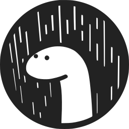
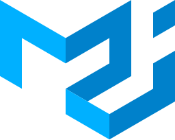
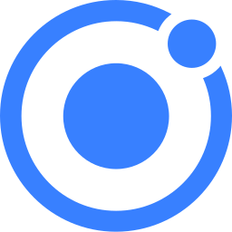
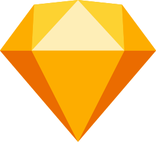

  

  

  
  
  
  
  
  
  
  

  

 

### Languages & Tools

 
  

### Github Stats

 

### GitHub Stats Degree

<table>
<tr>
<td><strong>S</strong></td>
<td>👑</td>
<td><em>Elite among the elite!</em></td>
<td><strong>Top 1%</strong></td>
</tr>
<tr>
<td><strong>A+</strong></td>
<td>🏆🏆🏆</td>
<td><em>Outstanding performance!</em></td>
<td><strong>Top 12.5%</strong></td>
</tr>
<tr>
<td><strong>A</strong></td>
<td>🏆🏆</td>
<td><em>Excellent skills!</em></td>
<td><strong>Top 25%</strong></td>
</tr>
<tr>
<td><strong>A-</strong></td>
<td>🏆</td>
<td><em>Great job!</em></td>
<td><strong>Top 47.5%</strong></td>
</tr>
<tr>
<td><strong>B+</strong></td>
<td>⭐⭐⭐⭐⭐</td>
<td><em>Solid contributions!</em></td>
<td><strong>Top 50%</strong></td>
</tr>
<tr>
<td><strong>B</strong></td>
<td>⭐⭐⭐⭐</td>
<td><em>Consistent efforts!</em></td>
<td><strong>Top 62.5%</strong></td>
</tr>
<tr>
<td><strong>B-</strong></td>
<td>⭐⭐⭐</td>
<td><em>Keep pushing forward!</em></td>
<td><strong>Top 75%</strong></td>
</tr>
<tr>
<td><strong>C+</strong></td>
<td>⭐⭐</td>
<td><em>Room for growth!</em></td>
<td><strong>Top 87.5%</strong></td>
</tr>
<tr>
<td><strong>C</strong></td>
<td>⭐</td>
<td><em>Welcome to the journey!</em></td>
<td><strong>Everyone</strong></td>
</tr>
</table>

